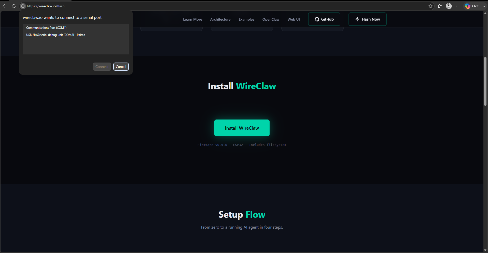
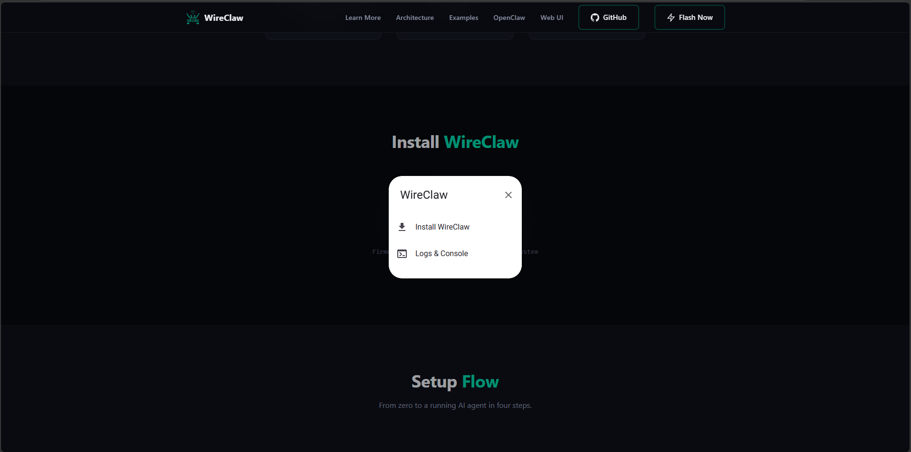
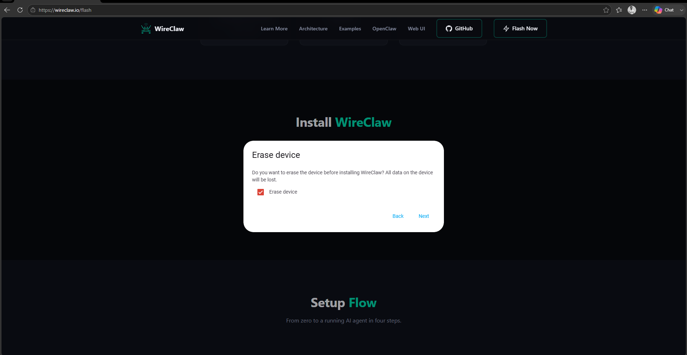
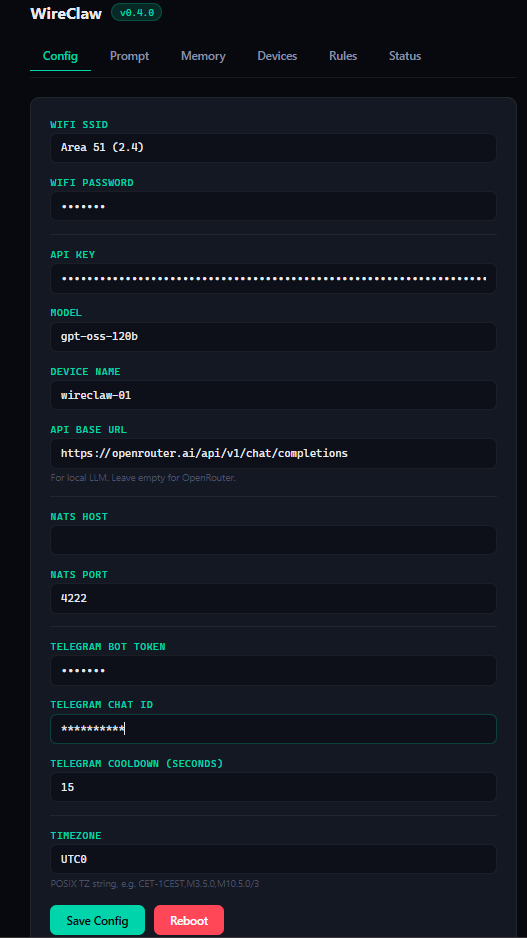
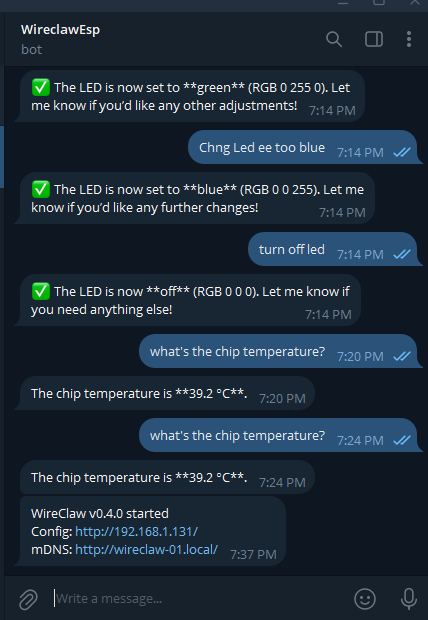

# WireClaw Setup Guide

This guide walks you through installing WireClaw, configuring it, and connecting it to OpenRouter and Telegram.

---

# Requirements

Before you begin, make sure you have:

- ESP32 / ESP32-S3 board
- USB Type-C / Micro USB cable
- Wi-Fi connection
- OpenRouter account
- Telegram account

---

# Step 1: Create an OpenRouter API Key

Visit:

https://openrouter.ai/workspaces/default/keys

Create a new API key and keep it somewhere safe.

> **Note**
>
> You can use any OpenAI-compatible API provider, but this guide uses **OpenRouter** because it provides free models.

---

# Step 2: Open WireClaw Flasher

Visit either of the following:

- https://wireclaw.io/
- https://wireclaw.io/flash

Click

**Flash Now**

or open the Flash page directly.

---

# Step 3: Install WireClaw

Click

**Install WireClaw**

You should now see the browser serial connection dialog.

Select your ESP32 serial port.



Click

**Connect**

Then click

**Install WireClaw**



---

# Step 4: Erase Device

WireClaw will ask whether you want to erase the device.

Choose

**Erase Device**



Then click

**Install**

The installation process usually takes around

**2–5 minutes**

☕

Take a coffee break while WireClaw flashes your device.

---

# Step 5: Connect to WireClaw Wi-Fi

After installation completes successfully, the ESP32 creates its own Wi-Fi network.

Connect your phone or computer to

```
WireClaw Setup
```

After connecting, the setup page should automatically appear.

If it doesn't, open your browser manually.

---

# Step 6: Configure WireClaw

Fill in the setup form.

## Wi-Fi

### Wi-Fi SSID

Enter your Wi-Fi network name.

Example

```
MyHomeWiFi
```

### Wi-Fi Password

Enter your Wi-Fi password.

---

## OpenRouter

### API Key

Paste the API key you created earlier.

Get it from

https://openrouter.ai/workspaces/default/keys

---

### Model

Enter the model you want to use.

Recommended free model:

```
gpt-oss-120b
```

You may use any OpenRouter-supported model.

---

### Device Name

Choose any name you like.

Example

```
Office ESP
Kitchen AI
WireClaw
Living Room
My Assistant
```

---

### API Base URL

Use

```
https://openrouter.ai/api/v1/chat/completions
```

This is the default OpenRouter Chat Completions endpoint.

---

# Step 7: Create a Telegram Bot

Open Telegram and search for

```
@BotFather
```

Or visit

https://t.me/BotFather

Follow these steps:

1. Send

```
/newbot
```

2. Enter your bot name.

Example

```
WireClaw Assistant
```

3. Choose a unique bot username.

Example

```
wireclaw_demo_bot
```

4. BotFather will return a Bot Token.

Example

```text
123456789:AAxxxxxxxxxxxxxxxxxxxxxxxxxxxxxxxxx
```

Copy this token.

Paste it into the

**Telegram Bot Token**

field in WireClaw Setup.

---

# Step 8: Get Your Telegram Chat ID

Open

https://t.me/userinfobot

Press

```
Start
```

The bot will reply with your Telegram information including your

```
Chat ID
```

Example

```text
Chat ID

123456789
```

Copy it.

Paste it into the

**Telegram Chat ID**

field.

---

# Step 9: Save Configuration

After filling everything,

Click

```
Save Config
```

Then click

```
Reboot
```



---

# Step 10: Successful Boot

After rebooting, WireClaw will send a Telegram message similar to this:

```text
WireClaw v0.4.0 started

Config:
http://192.168.1.131/

mDNS:
http://wireclaw-01.local/
```



---

# Configuration Dashboard

You can now open either

```
http://192.168.x.x/
```

or

```
http://wireclaw-01.local/
```

to access the WireClaw dashboard.

From there you can

- View Prompt
- View Memory
- View Devices
- View Rules
- View Status
- Update Configuration
- Manage Connected Devices

---

# Memory Examples

WireClaw can remember information you tell it.

Example:

You send

```text
My name is InHuman.
```

WireClaw replies

```text
Got it, InHuman!
Your name is now stored.
Let me know what you'd like to do.
```

Open

```
Memory
```

and you'll see your saved memory.

Later you can ask

```text
What is my name?
```

WireClaw replies

```text
Your name is InHuman.
```

---

# Device Information

You can ask questions about your ESP32.

Example

```text
What's the chip temperature?
```

Response

```text
The chip's temperature is 39.2 °C.
```

You can also ask for other system information depending on your firmware.

---

# Automation Rules

WireClaw supports natural language automation.

Example

```text
Send me the chip temperature every 2 minutes.
```

WireClaw will automatically send the temperature to Telegram every two minutes.

---

# Register Actuators

You can dynamically create actuators.

Example

```text
Register a digital output actuator called external_led on GPIO5
```

WireClaw will register the device.

Open

```
Devices
```

and you'll see

```
external_led
```

You can also control it using natural language.

Examples

```text
Turn on external_led
```

```text
Turn off external_led
```

```text
Set the LED to green.
```

```text
Set the LED to blue.
```

```text
Set the LED to red.
```

---

# Experiment

WireClaw supports many more features including

- Memory
- Rules
- Scheduling
- Sensors
- Actuators
- GPIO
- Device Management
- Prompt Editing
- AI Conversations

Explore and experiment with different commands.

---

# Learn More

Visit the official documentation:

https://wireclaw.io/learn-more

---

# Enjoy!

🎉 Your WireClaw device is now ready.

Start chatting with it through Telegram, automate your ESP32, register new devices, create rules, and explore everything WireClaw has to offer.